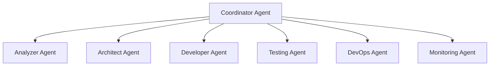

# AI Agent System Overview

## Metadata
```yaml
type: system-overview
purpose: agent-architecture
audience: [ai-agents, developers]
last-updated: 2024-03-20
```

## Agent System Architecture

The Orion agent system is organized in a hierarchical structure with specialized agents working together to manage the entire SDLC process.



## Core Agent Types

1. **Strategic Agents** - High-level decision making
2. **Tactical Agents** - Implementation and execution
3. **Support Agents** - Monitoring and maintenance 