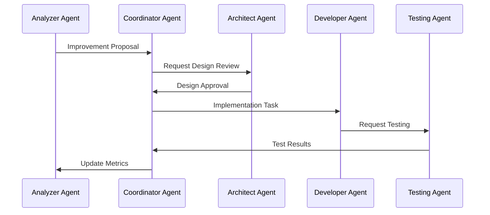
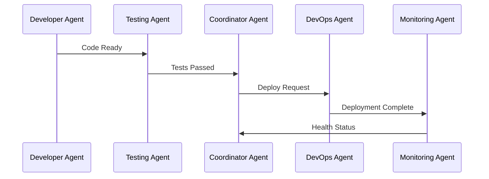

# Agent Workflows and Interactions

## Metadata
```yaml
type: workflow
purpose: process-definition
audience: [ai-agents, developers]
last-updated: 2024-03-20
```

## Core Workflows

### 1. System Improvement Cycle


### 2. Deployment Pipeline


## Communication Rules

1. **Chain of Command**
   - All major decisions go through Coordinator Agent
   - Agents can communicate directly for predefined workflows
   - Emergency protocols allow direct communication

2. **State Management**
   - All state changes are broadcast
   - State updates are versioned
   - Conflicts are resolved by Coordinator

3. **Error Handling**
   - Errors are reported to Coordinator
   - Retry logic is built into workflows
   - Fallback procedures are defined 