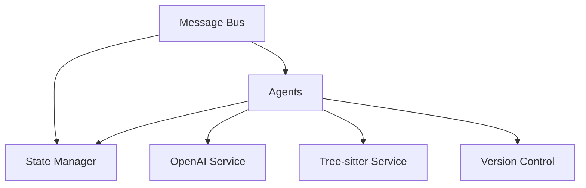
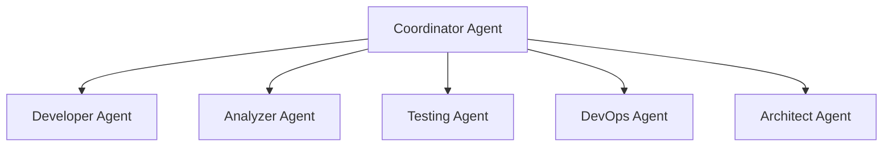
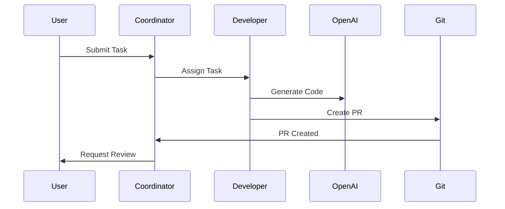
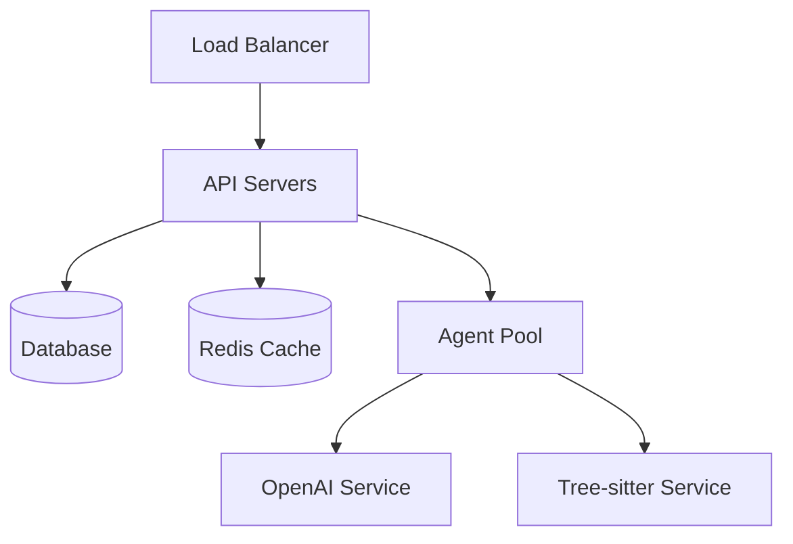

# Orion Architecture Overview

This document provides a comprehensive overview of Orion's system architecture, including component interactions, data flow, and technical decisions.

## System Components

### 1. Core Infrastructure

#### Message Bus
- Handles all inter-agent communication
- Implements pub/sub pattern
- Provides message validation and routing
- Ensures message delivery and acknowledgment

#### State Manager
- Maintains agent states
- Provides persistence layer
- Handles state transitions
- Manages recovery mechanisms

### 2. Agent System

#### Coordinator Agent
- Orchestrates other agents
- Manages task distribution
- Handles priority queues
- Monitors agent health

#### Developer Agent
- Generates code
- Reviews code changes
- Implements improvements
- Handles code refactoring

#### Analyzer Agent
- Performs code analysis
- Identifies improvements
- Tracks technical debt
- Monitors code quality

### 3. Services

#### OpenAI Service
- Handles API communication
- Manages rate limiting
- Implements retry logic
- Tracks token usage

#### Tree-sitter Service
- Parses code into AST
- Provides code metrics
- Enables code navigation
- Supports multiple languages

### 4. Data Flow

## Technical Decisions

### 1. Language & Runtime
- TypeScript for type safety
- Node.js for runtime
- Express for API server

### 2. Data Storage
- PostgreSQL for persistent storage
- Redis for caching
- File system for code storage

### 3. Communication
- WebSocket for real-time updates
- REST API for user interface
- Message queue for agent communication

### 4. Security
- JWT for authentication
- Role-based access control
- Secure credential storage
- API key management

## Deployment Architecture

### Infrastructure
- Docker containers
- Kubernetes orchestration
- Cloud provider agnostic
- Automated scaling

## Performance Considerations

### 1. Scalability
- Horizontal scaling of API servers
- Agent pool management
- Database sharding strategy
- Caching layers

### 2. Monitoring
- Performance metrics
- Error tracking
- Resource usage
- Cost monitoring

### 3. Optimization
- Response time targets
- Resource utilization
- Cost efficiency
- Cache hit ratios

## Future Considerations

### 1. Extensibility
- Plugin system
- Custom agent types
- Additional language support
- New service integrations

### 2. AI Improvements
- Model switching capability
- Local model support
- Custom model training
- Performance optimization

### 3. Integration
- Additional VCS support
- CI/CD integrations
- IDE plugins
- Project management tools 